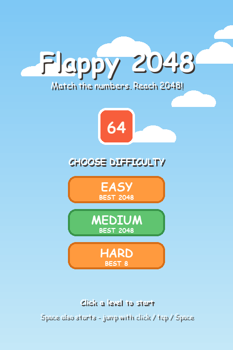
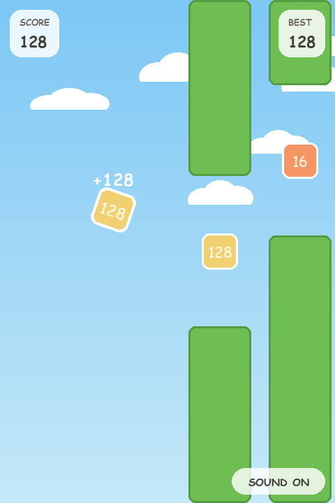
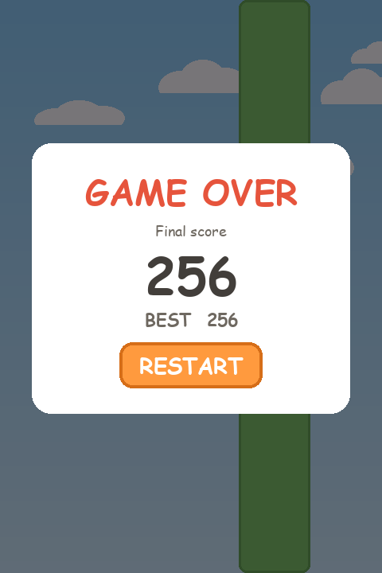
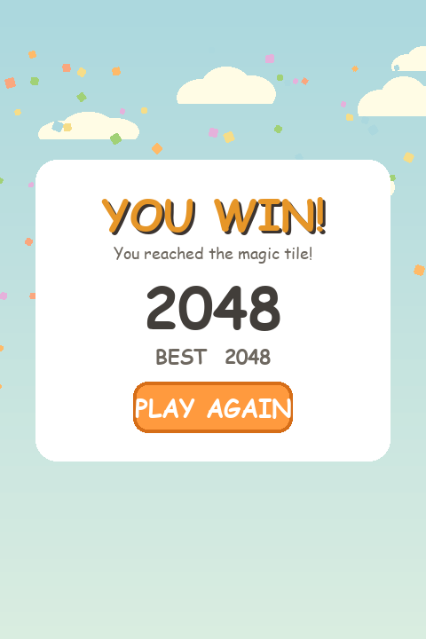

# 🎮 Flappy 2048

A 2D arcade game that mixes **Flappy Bird** mechanics with **2048**
scoring: hop a numbered cube through the gaps of scrolling columns,
merge equal numbers, and reach **2048** to win.

<div align="center">
  
  
  
  
</div>

---

## 🇮🇷 فارسی

### معرفی

بازی دوبعدی **Flappy 2048** ترکیبی از مکانیک فلاپیبرد و منطق امتیازدهی ۲۰۴۸ است. بهجای پرنده، یک **مکعب رنگی** داری که روی آن عدد امتیاز فعلی نوشته شده (شروع از ۲). با تپ/کلیک یا کلید Space مکعب میپرد و باید از میان شکاف ستونهای متحرک رد شوی. اگر به **بج عددی** وسط شکاف بخوری و عدد آن با عدد مکعبت برابر باشد، دو عدد مثل ۲۰۴۸ با هم جمع میشوند (۲+۲=۴) و رنگ و عدد مکعب آپدیت میشود. به **۲۰۴۸** برسی، برنده شدهای!

بازی با **pygame-ce** (نسخهی Community Edition فعال و بهروز پکیج pygame) ساخته شده و هستهی منطق آن (فیزیک، تولید ستونها، ترکیب اعداد) کاملاً **مستقل از pygame** است — یعنی لایهی رندر تنها جایی است که به pygame وابسته است و پورت آینده به HTML5/JavaScript بهراحتی انجام میشود.

### نصب و اجرا

```bash
pip install -r requirements.txt
python main.py
```

### کنترل بازی

| ورودی | عملکرد |
| --- | --- |
| کلیک / تپ / Space / ↑ / W | پرش |
| `P` | توقف (Pause) — هنگام از دست رفتن فوکوس پنجره هم خودکار pause میشود |
| `M` یا دکمهی SOUND گوشهی پایین-راست | قطع/وصل صدا |
| `Esc` یا `Q` | خروج |

### سطوح سختی

در صفحهی شروع سه سطح **EASY / MEDIUM / HARD** قابل انتخاب است؛ هر سطح ستونها (سرعت، رشد سرعت، اندازهی شکاف، فاصله) **و** مکعب (اندازه، جاذبه، قدرت پرش) را تنظیم میکند. آخرین انتخاب به خاطر سپرده میشود و **Best Score برای هر سطح جدا** ذخیره و روی دکمهی همان سطح نمایش داده میشود. از منوی Pause با دکمهی **MENU** میتوانی به صفحهی شروع برگردی و سطح را عوض کنی.

| پارامتر | EASY | MEDIUM | HARD |
| --- | --- | --- | --- |
| اندازهی مکعب | ۵۲px | ۵۶px | ۶۰px |
| جاذبه | ۱۳۰۰ | ۱۵۰۰ | ۱۶۰۰ |
| قدرت پرش | −۵۸۰ | −۵۶۰ | −۵۳۰ |
| ارتفاع پرش | ~۱۲۹px | ~۱۰۴px | ~۸۸px |
| اندازهی شکاف | ۲۴۶px | ۲۱۵px | ۱۹۰px |
| بازشدگی واقعی (شکاف − مکعب) | ۱۹۴px | ۱۵۹px | ۱۳۰px |
| سرعت پایه | ۱۱۵ | ۱۴۰ | ۱۷۰ |
| رشد سرعت | ۰.۰۰۳۰ | ۰.۰۰۳۸ | ۰.۰۰۵۵ |
| فاصلهی ستونها | ۲۸۰px | ۲۵۰px | ۲۴۰px |

**چیت کد مخفی 🤫:** موقع بازی (یا Pause) روی ردیف اعداد `2048` را تایپ کن تا مستقیم به صفحهی برد برسی.

### ساختار پروژه

| فایل | لایه | وظیفه |
| --- | --- | --- |
| `main.py` | اپ | نقطهی ورود، حلقهی بازی، ماشین حالت (Start / Playing / GameOver / Win) و مدیریت رویدادها |
| `settings.py` | تنظیمات | همهی مقادیر قابل تنظیم: سایز پنجره، فیزیک، رنگها، سطوح سختی — بدون import از pygame |
| `game_logic.py` | **منطق** | ترکیب اعداد (۲۰۴۸)، تولید عدد ستونها، دشواری تدریجی، کمکیهای برخورد — توابع خالص |
| `player.py` | **منطق** | مکعب بازیکن: فیزیک پرش/جاذبه، عدد فعلی، پالس ترکیب — بدون pygame |
| `obstacle.py` | **منطق** | ستونها: شکاف، بج عدد، حرکت، تست برخورد — بدون pygame |
| `storage.py` | **منطق** | ذخیرهی رکوردها، سطح انتخابی و حالت صدا در JSON — بدون pygame |
| `ui.py` | رندر | همهی ترسیمها: مکعب، ستونها، ابرها، کانفتی، HUD و صفحهها |
| `sound.py` | رندر | افکتهای صوتی سینتزشده (بدون فایل صوتی) |

انیمیشنها با **delta time** (`clock.tick(FPS)`) اجرا میشوند تا سرعت بازی روی هر سیستمی یکسان باشد.

### تست

```bash
# تستهای واحد منطق + تستهای یکپارچه (بدون نیاز به پنجره)
python -m unittest tests.test_logic tests.test_smoke

# اجرای سرپایی headless (~۲۰ ثانیه شبیهسازی، بدون پنجره)
python main.py --selftest
```

---

## 🇬🇧 English

### Overview

**Flappy 2048** is a 2D arcade game blending **Flappy Bird** mechanics
with **2048** scoring. Instead of a bird, you control a **colored
cube** that carries a number (starting at 2). Tap / click / press Space
to hop, and fly through the gaps of scrolling columns. Touch the
**number badge** inside a gap and, if it equals your cube's number, the
two merge like in 2048 (2+2=4) — your cube's color and number update.
Reach **2048** to win!

Built on **pygame-ce** (the actively maintained community edition of
pygame), with the core game logic (physics, column generation, number
merging) kept **completely independent of pygame** — only the rendering
layer touches pygame, so a future HTML5/JavaScript port is
straightforward.

### Install & run

```bash
pip install -r requirements.txt
python main.py
```

### Controls

| Input | Action |
| --- | --- |
| Click / tap / Space / ↑ / W | Jump |
| `P` | Pause (the game also auto-pauses when the window loses focus) |
| `M` or the SOUND pill (bottom-right) | Toggle sound |
| `Esc` or `Q` | Quit |

### Difficulty levels

The start screen offers **EASY / MEDIUM / HARD**. Each level tunes the
columns (base speed, speed growth, gap size, spacing) **and** the cube
(size, gravity, jump). Your last choice is remembered, and the **best
score is tracked separately per level** and shown on each level button.
From the pause menu, **MENU** returns to the start screen to switch
levels.

| Parameter | EASY | MEDIUM | HARD |
| --- | --- | --- | --- |
| Cube size | 52px | 56px | 60px |
| Gravity | 1300 | 1500 | 1600 |
| Jump velocity | −580 | −560 | −530 |
| Jump height | ~129px | ~104px | ~88px |
| Gap height | 246px | 215px | 190px |
| Real opening (gap − cube) | 194px | 159px | 130px |
| Base speed | 115 | 140 | 170 |
| Speed growth | 0.0030 | 0.0038 | 0.0055 |
| Column spacing | 280px | 250px | 240px |

**Hidden cheat 🤫:** while playing (or paused), type `2048` on the
number row to jump straight to the win screen.

### Project structure

| File | Layer | Purpose |
| --- | --- | --- |
| `main.py` | app | Entry point, game loop, state machine (Start / Playing / GameOver / Win), event handling |
| `settings.py` | config | All tunable values: window, physics, colors, difficulty levels — no pygame imports |
| `game_logic.py` | **logic** | 2048 merging, column number generation, gradual difficulty, collision helpers — pure functions |
| `player.py` | **logic** | Player cube: jump/gravity physics, current number, merge pulse — no pygame |
| `obstacle.py` | **logic** | Columns: gap, number badge, movement, collision tests — no pygame |
| `storage.py` | **logic** | Best scores, chosen level and mute state persisted to JSON — no pygame |
| `ui.py` | render | Everything drawn on screen: cube, columns, clouds, confetti, HUD, screens |
| `sound.py` | render | Synthesized sound effects (no audio asset files) |

Animations are driven by **delta time** (`clock.tick(FPS)`), so the
game runs at the same speed on any machine.

### Tests

```bash
# Logic unit tests + integration smoke tests (no window needed)
python -m unittest tests.test_logic tests.test_smoke

# Headless smoke run (~20s of simulated gameplay, no window)
python main.py --selftest
```
